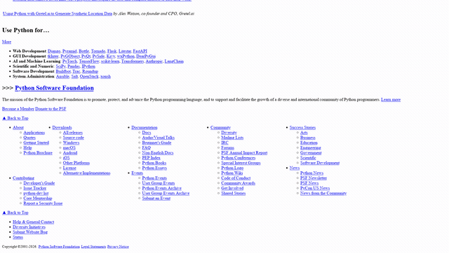

# Camoufox Research

[](https://aidvizhhub.github.io/camoufox-research/)

**Browser research toolkit for AI agents, exposed through MCP.**

Search the web. Read JS-heavy pages. Interact with websites. Extract data. Monitor changes.
**Give your AI agent a real browser.**


## Роутер тулов (tool_hint)

Не перебирай 62 тула вслепую — спроси **одну команду**:

`tool_hint(what="таблицы")` → `для «таблицы» → table_extract: таблицы со страницы`

| Спроси про... | Роутер ответит |
|---|---|
| поиск / статьи / анализ | web_search · paper_search · fetch_page |
| мониторинг / карта сайта | page_diff · map_site / sitemap |
| выжимки / отчёт / цитаты | research_digest · research_report · citation_pack |
| таблицы / скриншот / ссылки | table_extract · screenshot · extract_links |
| файлы / документ / профиль | read_document · session_download · profile_save |
| сеть / прокси / браузер | session_network · set_proxy · session_start |

## Переносимость путей (закон 28)

Всё работает из одного источника: env `CAMOUFOX_*` > `~/.cache/camoufox-research/config.env`
(пишет `install_mcp.py`) > авто-fallback. Никаких хард-путей.

| Команда | Что делает |
|---|---|
| `python scripts/install_mcp.py` | установка + запись config.env |
| `python scripts/install_mcp.py --print` | показать пути одной командой |
| `scripts/install_cron.sh [--dry]` | поставить/обновить крон-строки из config.env |
| `scripts/install_cron.sh --keep-timings` | обновить, сохранив СВОИ расписания |
| `scripts/install_cron.sh --remove` | снять наши строки (переезд) |
| `camo-publish <отчёт>` | опубликовать на витрину (найдёт репо сам) |

**direnv** (опционально, для dev): `direnv allow` в репо — подхватит
`.envrc`, который читает тот же config.env. Без direnv всё работает
как есть (`.envrc` только для тех, кто им пользуется).

```
    AI Agent
       │  (tools, resources, prompts)
       ▼
      MCP
       │
       ▼
Camoufox Research   ← this server (62 tools)
       │
       ▼
   Camoufox          ← anti-detect Firefox
       │
       ▼
      Web
```

Most MCP servers can *read* the web. This one can **live in it**: open pages,
click, type, fill forms, upload files, watch network traffic, take labeled
screenshots, crawl whole sites, extract tables, monitor changes — and hand
all of it to your agent through MCP (stdio, HTTP, or SSE).

---

## Why Camoufox Research?

Most MCP browser tools give an agent isolated actions. Here the goal is
different: **a complete toolkit for web research** — one server your agent
can use end to end.

- 🔎 **Search** — find sources (DuckDuckGo via anti-detect browser, deep `research` with 20+ distinct sources)
- 🌐 **Browse** — read JS/SPA pages, live sessions with tabs, clicks, forms, uploads
- 👁️ **Understand pages** — labeled screenshots (Set-of-Mark), snapshot trees with refs
- 📊 **Extract & export** — fields by CSS/XPath, tables → CSV, PDF/DOCX/XLSX, JSON/Markdown files

## ⚡ 30-second demo

> *"Find all pricing pages on this website, extract the prices and save them to CSV."*

```
Agent
 ├─ map_site     discover every /pricing page
 ├─ crawl        read them (cached)
 ├─ extract      {"plan": "css:.plan", "price": "css:.price"}
 └─ export       format=csv  →  prices.csv
```

No browser automation code. Just a sentence to your agent.

## What it does (real scenarios)

> 🔎 **Research** — *"Find information about this project, check 20 distinct sources and summarize."*
> `research` → `fetch_page` → `export`

> 🕷 **Crawl** — *"Walk the whole site and find every documentation page."*
> `sitemap` → `crawl` / `map_site`

> 📊 **Extract** — *"Collect prices from the table and save as CSV."*
> `extract` / `table_extract` → `export`

> 👁 **Vision** — *"Look at the page, find the Download button and press it."*
> `screenshot(som=True)` → `snapshot` → `session_click(ref="4")`

> 📡 **Monitor** — *"Check this page and tell me if it changed."*
> `fetch_page` → `page_diff` (delta-read saves tokens)

## One full scenario (killer demo)

```bash
git clone https://github.com/aidvizhhub/camoufox-research.git && cd camoufox-research
python3 -m venv ~/.venvs/camoufox-research
~/.venvs/camoufox-research/bin/pip install .
~/.venvs/camoufox-research/bin/python -m camoufox fetch   # download browser (once)
```

Then ask your agent:

> *"Find the latest articles about Camoufox, compare them and save the result to Markdown."*

```
Agent
 ├─ web_search        "camoufox browser"
 ├─ research          10+ sources, dedup
 ├─ fetch_page        read the best articles
 ├─ extract           title / date / key points per source
 ├─ page_diff         skip unchanged pages
 └─ export            format=md  →  report.md
```

That's the whole point: **your agent drives a real browser**, you just describe the goal.

## Deep research mode — 20+ distinct sources, not just top results

One `research` call, no agent loop needed:

```python
research(
    queries=["agent observability landscape", "agentic search 2026"],
    max_results_per_query=6,
    target_domains=20,  # goal: 20 DIFFERENT websites
    domains_limit=2,  # max 2 results per site (no 15 links from one blog)
    expand=True,  # add "X comparison", "X documentation" queries
    terms_wave=True,  # 2nd wave built from rare terms of the 1st wave
    quality_first=True,  # docs / GitHub / arXiv first, forums last
    academic=True,  # arXiv + Semantic Scholar (free, no keys)
    fetch_all=True,  # read text of every collected source
    as_json=True,  # machine-readable: meta / sources / texts / notes
)
```

**Academic channel** — the vertical index industry uses to get primary sources (Exa vs Tavily: publications R@1 63.3% vs 31.8%). Both APIs are free, no keys:

```python
paper_search("deep research agents")  # arXiv + Semantic Scholar
research(queries=["..."], academic=True)  # adds tier-0 papers to the hunt
```

**Digests & verified (`research_digest`, auto after background campaigns):**
after the hunt the runner cuts short digests (title + first paragraph) for cheap
synthesis and marks each source ✅ live / ❌ broken (verified citations gate,
DEER / DeepResearch Bench pattern). The done-marker gains `digests / verified
/ broken / fact` fields; `research_report` shows the status column.
**FACT counter (post_hunt):** the % of live citations
(`verified / (verified + broken)`) is logged, stored in the done-marker
(`fact`) and written to the memory note — goal ≥90% (DeepResearch Bench
FACT: Perplexity DR 90.24%); 0 checked sources = honest 0, not 100.

**One hunt at a time (guard):** a new campaign starts only if no other
campaign is `running` — 1 campaign = 1 worker = 1 browser (atomic
`INSERT ... WHERE NOT EXISTS`, no races; Playwright EPIPE lesson).

**Citation pack (`citation_pack`, after a campaign):** verified ✅ sources
with digests, one block, numbered [1]..[N] — the report citer writes with
live links only (DEER / DeepResearch Bench verified-citations gate).
Digests are menu-cleaned (`_digest_clean`: GitHub/SPA navigation junk is
stripped; `research_digest(camp_id, refresh)` rebuilds old packs).
**`citation_report(camp_id)`** saves the whole pack as a ready MD document
(`exports/{camp_id}.cit.md`): verified digests numbered [1..N] + References.
After a background campaign it's generated **automatically** (post_hunt) —
the done-marker carries `cit_report` with the file path.
**Memory note:** post_hunt also writes a summary line into a memory file —
`CAMOUFOX_MEMORY_FILE` if set (e.g. your own notes base), otherwise the
auto-created `~/.cache/camoufox-research/memory.md`:
topic, domains, verified, report path — the hunt isn't lost between sessions.

For automation, `as_json=True` returns a JSON payload instead of a text dump:

```json
{"meta": {"sources": 31, "domains": 20, "followup_queries": ["JSON-RPC"]},
 "sources": [{"title": "...", "url": "...", "domain": "arxiv.org",
              "tier": 0, "tier_label": "первоисточник", "snippet": "..."}],
 "texts": [{"url": "...", "text": "..."}],
 "notes": []}
```

How it works (industry patterns, researched 27.08.2026):
- **Query expansion** — each query gets reformulations (`comparison`, `documentation`), which surface different domains and angles.
- **Terms wave** — from the 1st wave's snippets the server extracts rare terms
  and names (proper nouns, CamelCase) and searches them next (Open Deep Research pattern).
- **Quality ranking** — official docs / GitHub / arXiv rank first, forums last
  (gpt-researcher source ranking); you can extend the registry in
  `camoufox_research/camoufox_sources.py`.
- **Second wave with pagination** — if the target of distinct domains isn't reached, a final pass (`pages=2`) collects the rest.
- **Domain dedup** — `docs.python.org` and `peps.python.org` count as one source (`python.org`); `example.co.uk` handled as a 3-part domain.
- **Echo of the goal in the output** — `доменов: N (цель 20)`, so you can see coverage at a glance.

Old behavior is preserved: `target_domains=0, domains_limit=0, expand=False, fetch_all=False` = plain top results.

## Need a tool? Start here

> Агент (а не человек)? Полное руководство «как пользоваться сервером» —
> [docs/agent-usage.md](docs/agent-usage.md): реестр, циклы, границы, ловушки.

| What you need | Tool |
|---|---|
| Find information | `web_search` |
| Read a page (even JS/SPA) | `fetch_page` |
| Read many pages at once | `batch_fetch` |
| Walk an entire site | `crawl` / `sitemap` |
| Get specific fields (CSS or XPath) | `extract` |
| Tables → CSV | `table_extract` |
| Click / type / press keys | `browser_click`, `session_click`, `session_type`, `session_key_press` |
| Understand the interface | `screenshot(som=True)`, `snapshot` (refs) |
| Fill a form in one call | `session_form_fill` |
| Upload a file | `session_upload` |
| Download a file | `session_download` |
| Watch network / JS console | `session_network`, `session_console` |
| Track changes | `page_diff`, `fetch_page(delta=True)` |
| Read PDF / DOCX / XLSX | `read_document` |
| RSS / sitemap feeds | `rss` |
| Check broken links | `check_links` |
| Save results to disk | `export` (json / csv / md) |
| Keep logins | `profile_save` / `profile_load` |
| Change proxy on the fly | `set_proxy` |
| See what the server did | `stats` (audit, secrets masked) |

## Vision — pages with numbers



```
Screenshot        snapshot          agent
   │                  │               │
   ▼                  ▼               ▼
┌──────────┐    - ref: 3       session_click(ref="3")
│ [1][2][3]│    - tag: a   ───► browser clicks exact element
│ [4] [5]  │    - text: "Download"
└──────────┘
```

`snapshot` returns a compact YAML tree of interactive elements (~2–5 KB instead
of 100 KB+ of HTML) with a `ref` on each. Click by `ref`, no fragile selectors.

## Quick Start

**Репо уже на диске** — это основной случай, и сети для него не нужно: ставится
именно код клона (в том числе своя ветка). Один вход:

```bash
bash scripts/install.sh             # из корня клона: venv → пакет → браузер → MCP → проверка
bash scripts/install.sh --dry-run   # сначала план для ЭТОЙ машины (ничего не меняет)
```

Клона нет (другая машина) — тот же установщик одной строкой с GitHub: он
склонирует репо сам в `~/camoufox-research`, дальше шаги те же:

```bash
curl -fsSL https://raw.githubusercontent.com/aidvizhhub/camoufox-research/main/scripts/install.sh | bash
```

Windows: `pwsh -NoProfile -File <репо>\scripts\install.ps1` из клона (фолбэк —
`irm …/install.ps1 | iex`). Подробности и таблица «клон / GitHub / Docker» —
`docs/install-crossplatform.md`.

Не хочешь установщик — то же самое руками:

```bash
# 1. Install (клон нужен только если его ещё нет)
git clone https://github.com/aidvizhhub/camoufox-research.git && cd camoufox-research
python3 -m venv ~/.venvs/camoufox-research
~/.venvs/camoufox-research/bin/pip install .

# 2. Download the browser (once)
~/.venvs/camoufox-research/bin/python -m camoufox fetch
```

3. Connect to your MCP client (OpenCode / Claude Desktop / Cursor) — see
   [Connect to MCP](#connect-to-mcp).
4. Ask your agent to research a website:

> *"Find the latest articles about Camoufox, compare them and save the result to Markdown."*

## Install

Рекомендуемый путь — один вход `bash scripts/install.sh` из клона
(см. Quick Start). Ниже — тот же результат по шагам, если хочешь видеть каждый;
клонировать из GitHub нужно **только если репо ещё нет на диске**.

```bash
git clone https://github.com/aidvizhhub/camoufox-research.git
cd camoufox-research

# 1. venv + package
python3 -m venv ~/.venvs/camoufox-research
~/.venvs/camoufox-research/bin/pip install .

# 2. download the browser (once)
~/.venvs/camoufox-research/bin/python -m camoufox fetch

# 3. smoke check (stdio server, waits on stdin)
~/.venvs/camoufox-research/bin/camoufox-research
```

Windows: `venv\Scripts\pip.exe install .`, `venv\Scripts\python.exe -m camoufox fetch`;
needs Python from python.org (not MS Store) and VC++ Redistributable.

## Connect to MCP

Готовый установщик — **одной командой**: репо на диске → venv в рантайме →
пакет → браузер → MCP в клиенте → рукопожатие. Из клона (основной путь; без
клона — строка с GitHub из Quick Start):

```bash
bash scripts/install.sh              # из корня клона (или <каталог-репо>/scripts/install.sh)
bash scripts/install.sh --reinstall  # переустановить пакет после правок
bash scripts/update_mcp.sh           # обновление: pull → pip → reconnect
```

Под установщиком — чипсет `scripts/install_mcp.py` (paths и секцию MCP пишет
только он; вызывается его функции, а не клон с гита):

```bash
python scripts/install_mcp.py              # установка с нуля + запись config.env
python scripts/install_mcp.py --reinstall  # переустановить (force)
```

Вручную (если хочешь сам смотреть каждый шаг):

```bash
git clone https://github.com/aidvizhhub/camoufox-research.git   # только если клона нет
cd camoufox-research
python3 -m venv ~/.venvs/camoufox-research
~/.venvs/camoufox-research/bin/pip install .                     # код клона, не git+https
~/.venvs/camoufox-research/bin/python -m camoufox fetch          # браузер, один раз
```

`pip install .` ставит **то, что лежит на диске** — так и надо, когда клон уже
есть (в т.ч. своя ветка). `git+https://…@main` — другой сценарий: обновление
с гита на машине без клона (`scripts/update_mcp.sh` делает это штатно).

Затем в `~/.config/opencode/opencode.json`:

```json
{
  "mcp": {
    "camoufox": {
      "type": "local",
      "command": ["/path/to/venv/bin/camoufox-research"],
      "enabled": true
    }
  }
}
```

Claude Desktop, Cursor and others — ready-made examples in `mcp/config/`.
No install needed: `python mcp/server.py` works from sources.

Check: `opencode mcp list` → `camoufox: connected`.

## Tools (48)

| Group | Tools |
|---|---|
| Research | `research` (deep search + reading), `web_search`, кампании: `research_start` (цель «N разных сайтов», фон + счётчик), `research_status`, `research_report`, `research_resume` (доборка partial/failed с места) |
| Reading | `fetch_page` (+ `delta`), `batch_fetch`, `extract_links`, `read_document` (PDF/DOCX/XLSX) |
| Structure | `extract` (CSS + XPath), `crawl` (BFS), `map_site`, `sitemap` (+.gz, nested), `table_extract` |
| Data | `export` (json/csv/md), `rss`, `check_links` |
| Vision | `screenshot` (+ `som=True` — Set-of-Mark), `snapshot` (refs) |
| Browser | `browser_navigate`, `browser_click` (+ref), `browser_type` |
| Live session | `session_start/navigate/click/type/scroll/links/text/back/status/end`, `session_tabs`, `session_wait_for`, `session_eval`, `session_key_press`, `session_select_option`, `session_resize`, `session_form_fill`, `session_upload` |
| Network | `session_network`, `session_console`, `session_block`/`session_unblock` |
| Files | `session_download`, `page_diff` |
| Observability | `stats` (audit, masked), `cache_info`, `research_index` (все кампании) |
| Network config | `set_proxy`, `profile_save`/`profile_load` |
| Service | `ping` |

## MCP Resources & Prompts

- **Resources** (data readable "as files"): `camoufox://stats`, `camoufox://cache`,
  `camoufox://session`, `camoufox://info`
- **Prompts** (ready-made recipes): `research_plan`, `extract_schema`, `monitor_page`

## Profile caps (fewer tools, better selection)

> 60 always-on tools degrade agent tool-choice (industry: past ~40 the selection
> quality drops). Pick groups, like Playwright MCP `--caps`:

```bash
camoufox-research --caps research,browser        # or env CAMOUFOX_CAPS
```

Установщики ставят дефолт агента `research,browser,session,vision` (ресёрч, чтение страниц, живая
вкладка, картинки): так агент сходу умеет и искать, и работать со страницей. Сузить — задать
`CAMOUFOX_CAPS` явно (у консольной обёртки и в записи MCP-клиента дефолт не перетирается), например
`CAMOUFOX_CAPS=research,browser`; сам сервер без переменной отдаёт `research,browser` (34 тула).

| Group | Tools |
|---|---|
| `research` | web_search, research/start/status/report/resume/index, digests, citations, critic, routers |
| `browser` | fetch/batch_fetch, extract, table_extract, crawl, map_site, sitemap, rss, read_document, check_links, export, page_diff, browser_* |
| `session` | session_* (live tab, forms, network, files), set_proxy, profile_save/load |
| `vision` | snapshot, screenshot |

`ping`/`stats` are always on. Без `--caps`/`CAMOUFOX_CAPS` работает дефолт сервера
`research,browser` (34 тула); полный реестр — только явно: `CAMOUFOX_CAPS=all`.
`CAMOUFOX_TOOLS_ONLY`/`CAMOUFOX_TOOL_HIDE` still apply on top.
Unknown group → warning; valid groups still activate. New tool without a
group fails `tests/test_caps.py` (fail-fast).
Tool order is frozen (sorted by name at startup) — stable prompt prefix
(prompt-cache hygiene). On MCP SDK 2.x (spec 2026-07-28) `tools/list`
carries `ttlMs`/`cacheScope` hints (24h, public; SEP-2549) — a 2026-era
client may cache the list for a day; OpenTelemetry tracing is on by
default (opentelemetry-api).

## Diagnose from CLI («мёртв» MCP — быстрый ответ)

`Unknown tool` — это обычно НЕ «тула нет», а сервер не пересоздан после
смены кода. Живой диагноз одной командой (без клиента, read-only):

```bash
python scripts/mcp_probe.py            # человек-читаемо
python scripts/mcp_probe.py --json     # машинно (мониторинг)
# покажет: python/repo → caps → protocol → СКОЛЬКО тулов отдаёт tools/list →
# версия пакета → пульс сторожа поиска
```

Что смотреть: `tools=N` маленький или рукопожатие ❌ → старый код в venv
(pip-кэш колеса!) → переустановить из клона: `bash scripts/install.sh --reinstall`
(на машине без клона — `pip install --force-reinstall --no-cache-dir git+https://github.com/aidvizhhub/camoufox-research.git@main`)
→ reconnect (API disconnect/connect, не kill).

Второй уровень (интерактивный, индустриальный стандарт —
[ресёрч 28.08: 21 домен]): **MCP Inspector** для пошагового теста
тулов (`npx @modelcontextprotocol/inspector -- python -m camoufox_research.camoufox_research`),
диагностический workflow из [mcp-for-beginners: Testing and Debugging](https://github.com/microsoft/mcp-for-beginners)
и troubleshooting-гайды (mcpevals.io, genaiskills.io). Наш probe — быстрый
read-only «кодекс-доктор» сервера; Inspector — когда нужен диалог с тулами.

## Transports

`stdio` (default) · `streamable-http` (stateless — **primary for remote
prod**, MCP 2026-07-28) · `sse` (legacy — deprecated in the 2026-07-28
spec, kept for the 12-month window):

```bash
camoufox-research --transport http --port 8833   # 'http' = streamable-http
CAMOUFOX_PORT=8833 camoufox-research --transport http   # or via env
```

## Benchmarks — truth-recall (honest numbers)

Method: [fastCRW `diagnose_3way.py`](https://fastcrw.com/blog/truth-recall-explained-web-scrapers)
scoring (`phrases > 20 chars`, `recall >= 0.3` = found), same public
dataset `firecrawl/scrape-content-dataset-v1` (819 labeled URLs).
Reproduce: `python scripts/bench_truth_recall.py --sample N`.

| Tool | Truth-recall | Run |
|---|---|---|
| **camoufox-research** (fetch, `article_only`, retry policy) | **53.3%** (16/30) | 2026-08-28, sample 30/819 |
| fastCRW | 63.74% (522/819) | 2026-05-08, full 819 |
| Crawl4AI | 59.95% (491/819) | 2026-05-08, full 819 |
| Firecrawl | 56.04% (459/819) | 2026-05-08, full 819 |

⚠️ Not directly comparable: different sample, date, and limits
(`article_only` + 4000 chars — what an agent actually sees). Same
methodology, honest denominator + date. After the retry policy (28.08):
empty responses 9 → 0, recall 43.3% → 53.3% on the same 30 URLs.

## Documentation

| Документ | О чём |
|---|---|
| [docs/RESEARCH-PLAYBOOK.md](docs/RESEARCH-PLAYBOOK.md) | как выжимать максимум полноты: рецепты «быстро / полно / глубоко», замеры символов и секунд, рычаги (`max_chars`, `CAMOUFOX_FETCH_LIMIT`, `article_only`, `fetch_all`), где мы сильнее tavily/exa и где они |
| [docs/VERIFICATION.md](docs/VERIFICATION.md) | что и чем проверено: 297 юнит-тестов (срез 21.09), 18 bats, 5 своих правил semgrep, soak (зомби/сироты/RSS), стражи URL и пути, контракт `isError`, Docker/PowerShell — и честный раздел «что НЕ проверено» |
| [docs/agent-usage.md](docs/agent-usage.md) | руководство для агента: профили caps, порядок вызовов, границы, ловушки |

## Behavior

- Кампании (research_start) помнят прогресс в sqlite: счётчик РАЗНЫХ
  сайтов, доборка волнами, честный partial; research_resume добирает
  с места. Отчёт автоархивируется (CAMOUFOX_REPORT_DIR → research/
  репы, по умолчанию exports кэша).
- Вторая нога охоты — фиды: research_start(feeds=[RSS/sitemap...])
  собирает источники БЕЗ поисковика (queries можно опустить).
- Сторож поиска (scripts/watchdog_search.py + cron) проверяет DDG
  реальным путём: провал → watchdog_ALERT; research_start проверяет
  пульс крона и предупреждает, если тот молчит.- Ларец не переполняется: `research_index` — сводка всех кампаний;
  `scripts/campaign_cleanup.py` (dry-run по умолчанию, --yes) выметает
  артефакты старше 30 дней. Отчёты .md метла не трогает.

## Real output

Так выглядит автоархив кампании (полный файл —
[docs/example-report.md](docs/example-report.md); добыта ТОЛЬКО фидом
hnrss.org, поисковик не вызывался):

```
# Кампания: hacker news frontpage
- источников: 20, разных сайтов: 16/6        · статус: done

| # | источник | домен | класс |
|---|---|---|---|
| 1 | [Confdiff – semantic diff for config files](github.com/…) | github.com | первоисточник |
```

## Publish to PyPI

Имя свободно, упаковка проверена (`python -m build` + `twine check` —
PASSED). Публикация — через Trusted Publishing (OIDC, без токенов):

1. pypi.org → «Add a pending publisher»: owner `aidvizhhub`,
   repo `camoufox-research`, workflow `release.yml`, environment `pypi`.
2. На GitHub: Settings → Variables → `PYPI_PUBLISH = yes`.
3. `gh release create v0.9.0 --title v0.9.0 --notes "..."` — workflow
   соберёт и опубликует; дальше у всех: `pip install camoufox-research`.
Без шага 1-2 джоб publish честно SKIP — CI не краснеет.

- Browser lives in a separate worker process (sync, headless) — the MCP stdio
  server never blocks.
- JS/SPA pages are read without preparation: content polling + scroll +
  stability detection; empty → retry.
- Cache: sqlite `~/.cache/camoufox-research/cache.db`, TTL 24h, retry with
  backoff; `delta=True` skips re-reading unchanged pages.
- Config via environment only (see `configs/example.env`): `CAMOUFOX_VENV`,
  `CAMOUFOX_CACHE_DIR`, timeouts, proxy.
- Campaign reports go to `CAMOUFOX_REPORT_DIR` if set; otherwise to
  `research/` **next to this repo** (portable, convention `research/README.md`);
  fallback — `~/.cache/.../exports`. `research/INDEX.md` lists all reports by date.

## Development

See [CONTRIBUTING.md](CONTRIBUTING.md): layout, adding a new tool, smoke-test ritual.

## Сторож поиска (cron) — ОБЯЗАТЕЛЕН для честных кампаний

`scripts/watchdog_search.py` ходит в DDG реальным путём: разметка сменилась
→ `_search_results` молча вернёт 0, кэш на сутки замаскирует, кампании
станут честными «partial» без причины. Сторож ловит это ДО охот (shift-left):
провал → файл `watchdog_ALERT`; `research_start` проверяет пульс крона и
предупреждает, если тот молчит дольше `CAMOUFOX_STALE_H` (по умолчанию 48ч).

Cron (идемпотентно, одна строка; путь вентиля — `CAMOUFOX_WATCHDOG_LOG`):

```bash
7 9,21 * * * ~/.venvs/camoufox-research/bin/python \
  /путь/к/camoufox-research/scripts/watchdog_search.py \
  >> ~/.cache/camoufox-research/watchdog.log 2>&1
```

Проверка пульса: `watchdog.log` должен иметь строки `ok` с таймстампами.
Молчит → `research_start` скажет «⚠ сторож не найден/молчит».

## CI

GitHub Actions on every push: install on Python 3.10/3.11/3.12/3.13, import check,
MCP stdio smoke (initialize → tools/list → ping). Full browser tests run
locally (`scripts/update_camoufox.py` + manual smoke).

## Experience journal

[EXPERIENCE.md](EXPERIENCE.md) — verified lessons and landmines ("what not to
step on"): asyncio/serve pitfalls, 403-vs-urllib, non-thread-safe Playwright,
ElementTree XPath limits, and more.

## Dependency licenses

- [camoufox](https://github.com/daijro/camoufox) — see its repo
- [mcp](https://github.com/modelcontextprotocol/python-sdk) — MIT
- [trafilatura](https://trafilatura.readthedocs.io/) — GPL-3.0 (optional: text extraction)

---

**AGGG [Distro] Firmware** · автор — **@hilartem** (Telegram). Сообщества: [список](https://t.me/addlist/5mU_0C6bqxY4MDky) · [группа](https://t.me/aidvizh_hub) · [lab](https://t.me/aidvizh_lab) · [канал](https://t.me/aidvizhenie) · [форум](https://t.me/dvizhforum)
