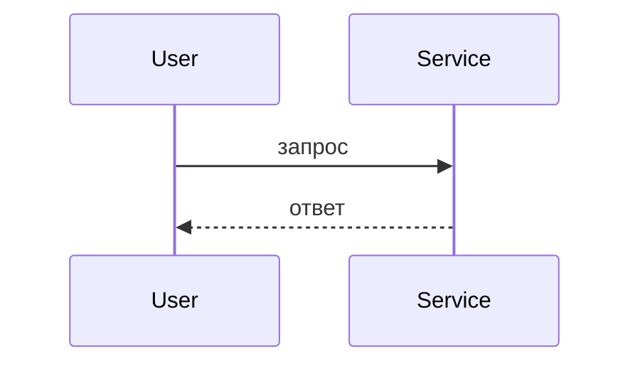

# Design Document

## Overview

{{2–3 абзаца максимум.}}

**Purpose:** {{какую конкретную ценность даёт фича и кому.}}
**Users:** {{кто и для каких сценариев это использует.}}
**Impact:** {{что меняется в текущем состоянии системы.}}

### Goals

- {{Основная цель}}
- {{Критерий успеха}}

### Non-Goals

- {{Явно исключённая функциональность}}
- {{Отложенные точки интеграции}}

## Architecture

### Existing Architecture Analysis

{{Только если система существующая: текущие паттерны и ограничения, границы доменов, которые нельзя
нарушить, поддерживаемые точки интеграции, обходимый технический долг.}}

### Architecture Pattern & Boundary Map


- **Выбранный паттерн:** {{название и краткое обоснование}}
- **Границы домена:** {{как разделены обязанности, чтобы не конфликтовать}}
- **Сохранённые паттерны:** {{что оставлено как было}}
- **Новые компоненты:** {{и почему каждый нужен}}
- **Соответствие steering:** {{какие принципы проекта соблюдены}}

### Technology Stack

| Слой | Выбор / версия | Роль в фиче | Примечания |
|------|----------------|-------------|------------|
| Клиент / CLI | | | |
| Сервер / сервисы | | | |
| Данные / хранилище | | | |
| Очереди / события | | | |
| Инфраструктура | | | |

## File Structure Plan

{{Управляет аннотациями `_Boundary:_` в задачах. Для маленькой фичи — отдельные файлы с обязанностями,
для большой — структура каталогов плюс паттерн, отдельно только неочевидные файлы.}}

```
src/
├── domain-a/
│   ├── controller.ts      # обработчики эндпоинтов
│   ├── service.ts         # бизнес-логика
│   └── types.ts           # доменные типы
└── shared/
    └── cross-cutting.ts   # неочевидно: зачем существует
```

### Modified Files

- `path/to/existing.ts` — что меняется и почему

> В этой секции не должно остаться `TBD`. У каждого компонента из раздела ниже здесь есть файл.

## System Flows

{{Только те диаграммы, которые объясняют неочевидный поток. Sequence — взаимодействие сторон,
process/state — ветвление или жизненный цикл, data/event flow — конвейеры и асинхронные сообщения.
Для простого CRUD секция не нужна вовсе.}}



## Requirements Traceability

{{Обязательна, когда требования затрагивают несколько домен.}}

| Requirement | Суть | Компоненты | Интерфейсы | Потоки |
|-------------|------|------------|------------|--------|
| 1.1 | | | | |
| 1.2 | | | | |

## Components and Interfaces

| Компонент | Слой | Назначение | Покрывает требования | Зависимости (P0/P1) | Контракты |
|-----------|------|------------|----------------------|---------------------|-----------|
| {{ExampleComponent}} | {{UI}} | {{что делает}} | 1.1, 2.1 | {{Dep (P0)}} | Service, State |

{{Полные блоки ниже — только для компонентов с новой границей: логика, внешняя интеграция, хранилище.
Простые презентационные компоненты обходятся строкой в таблице плюс короткой заметкой.}}

### {{Домен / слой}}

#### {{Название компонента}}

| Поле | Значение |
|------|----------|
| Назначение | {{одна строка}} |
| Требования | 1.1, 2.3 |
| Владелец / ревьюеры | {{опционально}} |

**Обязанности и ограничения**

- {{Основная обязанность}}
- {{Граница домена и область транзакции}}
- {{Инварианты и владение данными}}

**Зависимости**

- Входящие: {{компонент — зачем (критичность)}}
- Исходящие: {{компонент — зачем (критичность)}}
- Внешние: {{сервис/библиотека — зачем (критичность)}}

**Контракты**: Service [ ] / API [ ] / Event [ ] / Batch [ ] / State [ ] — отметить нужные.

##### Service Interface

```typescript
interface {{ComponentName}}Service {
  methodName(input: InputType): Result<OutputType, ErrorType>;
}
```

- Предусловия:
- Постусловия:
- Инварианты:

##### API Contract

| Метод | Эндпоинт | Запрос | Ответ | Ошибки |
|-------|----------|--------|-------|--------|
| POST | /api/resource | CreateRequest | Resource | 400, 409, 500 |

##### Event Contract

- Публикует:
- Подписан на:
- Гарантии порядка и доставки:

##### State Management

- Модель состояния:
- Персистентность и согласованность:
- Стратегия конкурентного доступа:

**Implementation Notes**

- Интеграция:
- Валидация:
- Риски:

## Data Models

### Domain Model

- Агрегаты и границы транзакций
- Сущности, value-объекты, доменные события
- Бизнес-правила и инварианты

### Logical Data Model

- Связи и кардинальность
- Атрибуты и типы
- Естественные ключи
- Правила ссылочной целостности

### Physical Data Model

{{Только если реализация требует конкретных решений по хранению: таблицы и типы, ключи и ограничения,
индексы, партиционирование.}}

## Error Handling

### Error Strategy

{{Паттерны обработки и восстановления по типам ошибок.}}

### Error Categories and Responses

- **Пользовательские (4xx):** неверный ввод → валидация на уровне поля; нет доступа → подсказка; не найдено →
  навигационная помощь.
- **Системные (5xx):** отказ инфраструктуры → деградация; таймаут → предохранитель; исчерпание → ограничение
  частоты.
- **Бизнес-логика (422):** нарушение правила → объяснение условия; конфликт состояния → подсказка перехода.

### Monitoring

{{Отслеживание ошибок, логирование, проверки здоровья.}}

## Testing Strategy

- **Unit:** 3–5 проверок ядра ({{...}})
- **Integration:** 3–5 сквозных потоков между компонентами ({{...}})
- **E2E / UI:** 3–5 критических путей пользователя ({{...}})
- **Performance / Load:** 3–4 сценария ({{...}}), если есть цели по нагрузке

### Properties to Test

{{Свойства, извлечённые из EARS-требований. См. references/correctness.md.}}

| Требование | Свойство | Форма |
|------------|----------|-------|
| 1.1 | {{для любых входов, где … , верно …}} | инвариант / round trip / идемпотентность |

<!-- Проверка перед записью:
     - все числовые ID из requirements.md встречаются в traceability или в таблице компонентов;
     - File Structure Plan заполнен реальными путями, без TBD;
     - у каждого компонента есть файл в File Structure Plan;
     - нет спекулятивных абстракций «на будущее»;
     - нет отдельных research-файлов, если хватает контекста. -->
